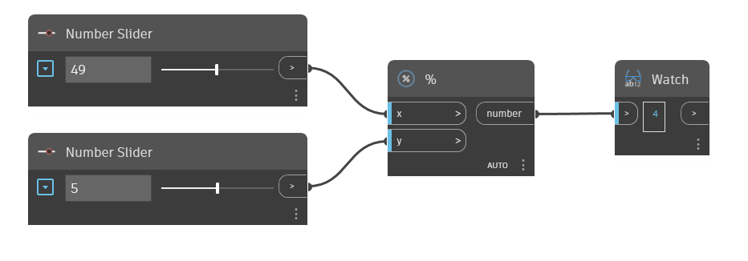

## In Depth
The `%` node is the modulo operator. It returns the remainder of the `x` input after it is divided by the `y` input. 

In the example below, a `%` node is used to return the remainder of x/y. We use two number sliders to control the inputs to the `%` operator.
___
## Example File

