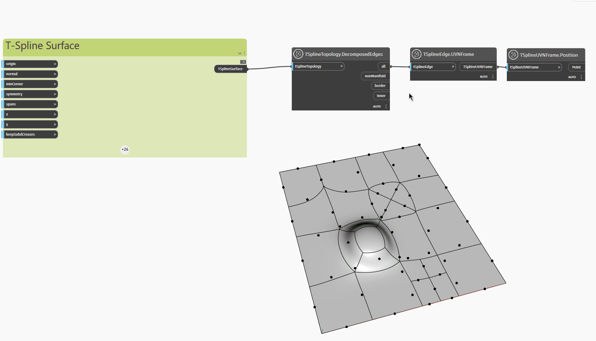

## In Depth
In the example below, a planar T-Spline surface with extruded, subdivided and pulled vertices and faces is inspected with the `TSplineTopology.DecomposedEdges` node, which returns a list of the following types of edges contained in the T-Spline surface:

- `all`: list of all edges
- `nonManifold`: list of non-manifold edges
- `border`: list of border edges
- `inner`: list of inner edges

The nodes `TSplineEdge.UVNFrame` and `TSplineUVNFrame.Position` are used to highlight the different types of edges in the surface.
___
## Example File

