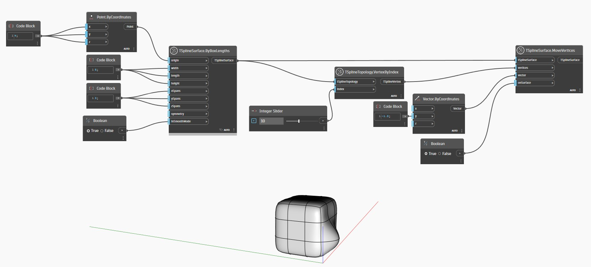

<!--- Autodesk.DesignScript.Geometry.TSpline.TSplineTopology.VertexByIndex --->
<!--- 7LRWGLADXMQPJN33WBBRTYBBK4NO6FQADRQICYVBDCTWPJ3FOONQ --->
## In Depth
In the example below, a vertex of a T-Spline surface is collected using the `TSplineTopology.VertexByIndex` node. The vertex is then used as input for the `TSplineSurface.MoveVertices` node.
___
## Example File

