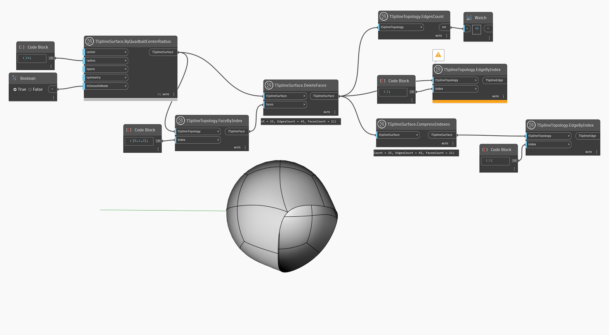

<!--- Autodesk.DesignScript.Geometry.TSpline.TSplineSurface.CompressIndexes --->
<!--- ARIV6OQ22ACATWAIKGM7OHNEJS2TQUOKUSEU6UNX6EAAVSJIMK3A --->
## In Depth
The node `TSplineSurface.CompressIndexes` removes gaps in index numbers of edges, vertices or faces of a T-Spline Surface that result from various operations such as Delete Face. The order of indices is preserved. 

In the example below, a number of faces is deleted from a quadball primitive surface which affects the edge indices of the shape. `TSplineSurface.CompressIndexes` is used to repair the edge indices of the shape and thus selecting an edge with the index 1 becomes possible. 

## Example File

