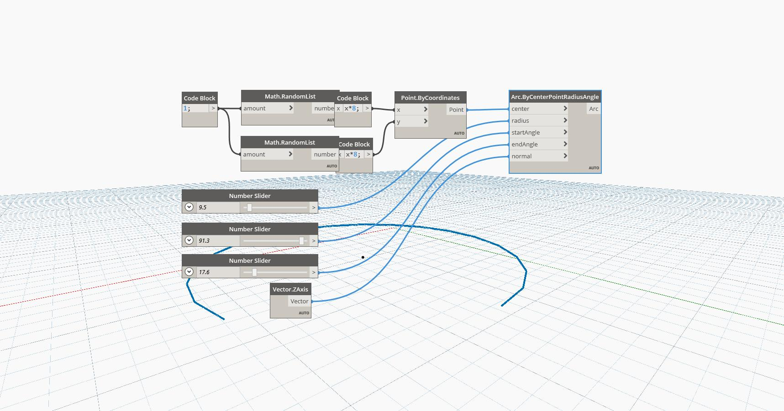

## In Depth
Arc ByCenterPointRadiusAngle draws an arc relative to its center and normal direction. By entering the start and end angle, you are essentially drawing a portion of a circle. In this example, a random point is generated on the XY plane and an arc is constructed around it.  
___
## Example File

