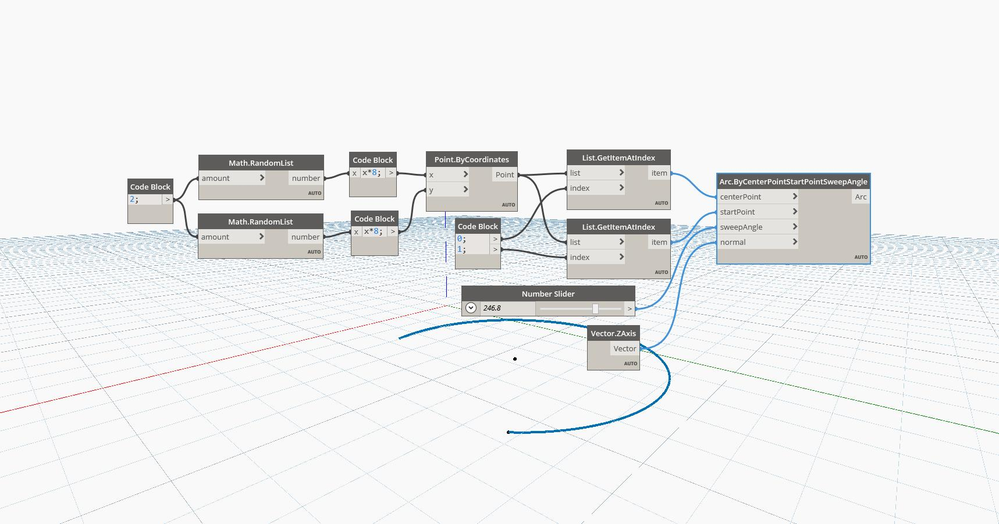

## In Depth
The Arc ByCenterPointStartPointSweepAngle creates an arc around a Center Point with a given Sweep Angle. The Start Point tells Dynamo where to begin drawing the arc. This example draws an arc around a randomly generated point.
___
## Example File

