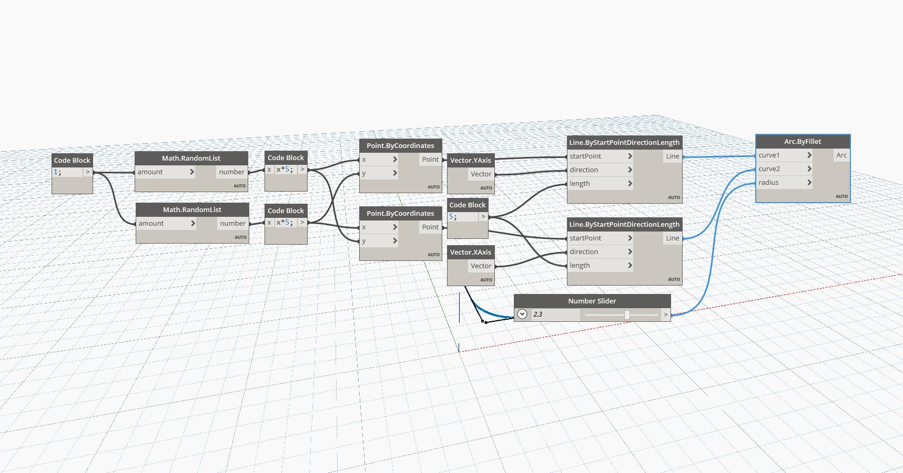

## In Depth
Arc ByFillet draws a portion of a tangential circle along two input curves. In this example, two intersecting lines are drawn and then filleted at a controlled radius.
___
## Example File

