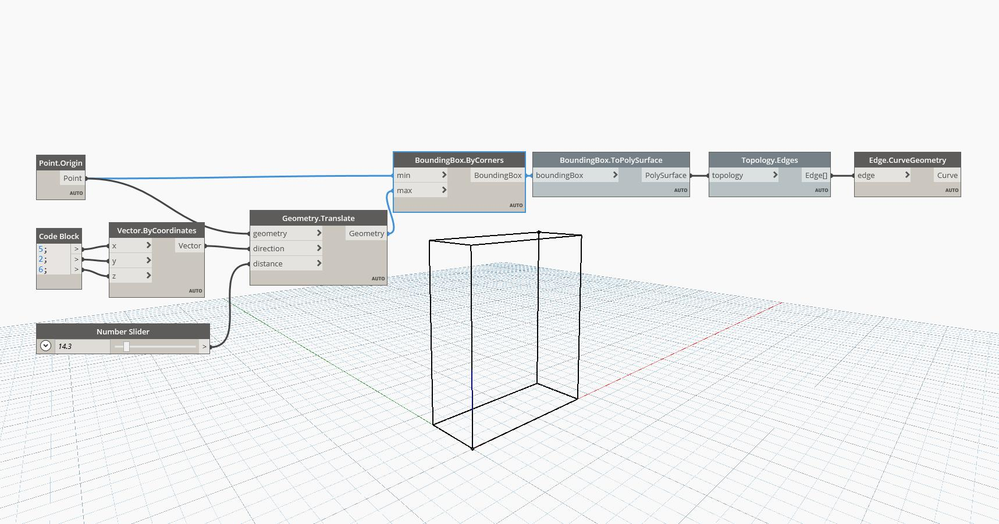

## In Depth
Cuboid By Corners creates a cuboid where the two input points are used as the opposite corners of the cuboid. In the example file, two points are randomly generated and used to create a cuboid.
___
## Example File

