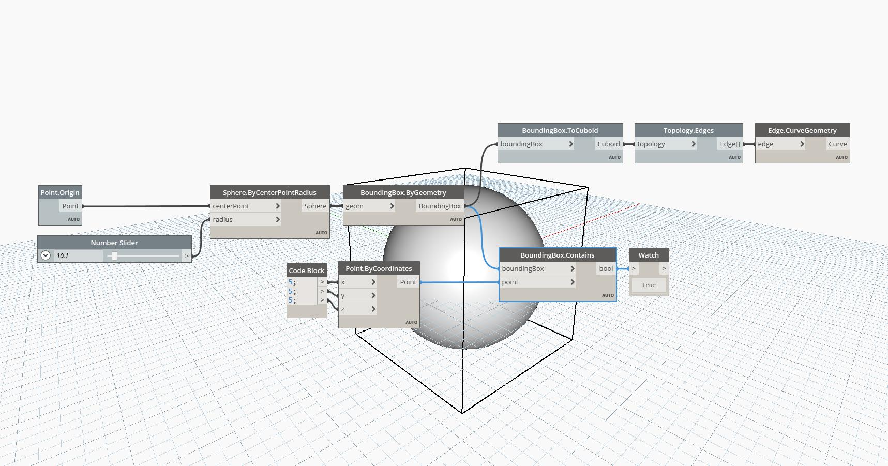

## In Depth
Bounding Box Contains tests if a specified Point is inside of a Bounding Box. Because the Point in this example is at (5,5,5), and our Origin Sphere’s Radius is larger than 5, the Contains node will return True.
___
## Example File

