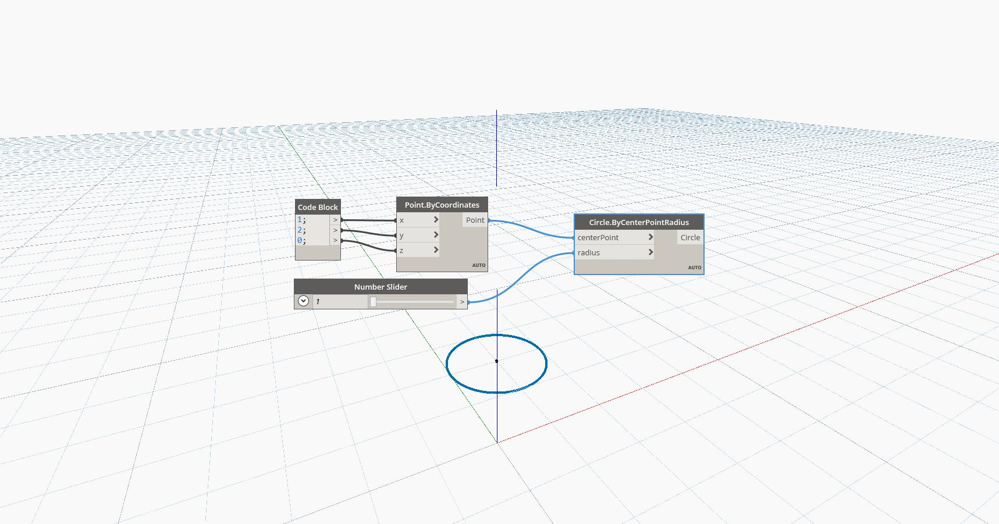

## In Depth
Sphere by Center Point Radius will create a sphere centered at the input point, and with an input radius. In the example below, we use a code block to specify the coordinates of a Point created by coordinates, and we use a number slider to determine the radius of the sphere.
___
## Example File

