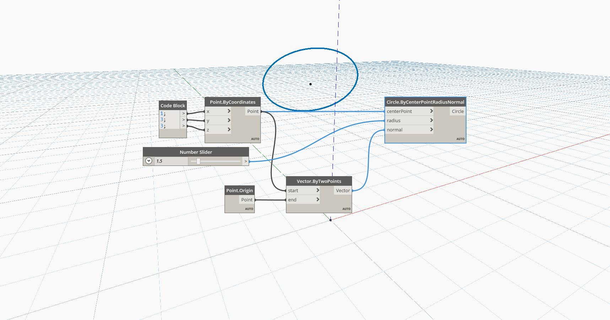

## In Depth
Circle By Center Point Radius Normal creates a circle at a point with a controllable radius and normal. In this example, we create a vector from the Origin Point to the Point By Coordinates to control the direction of the circle.
___
## Example File

