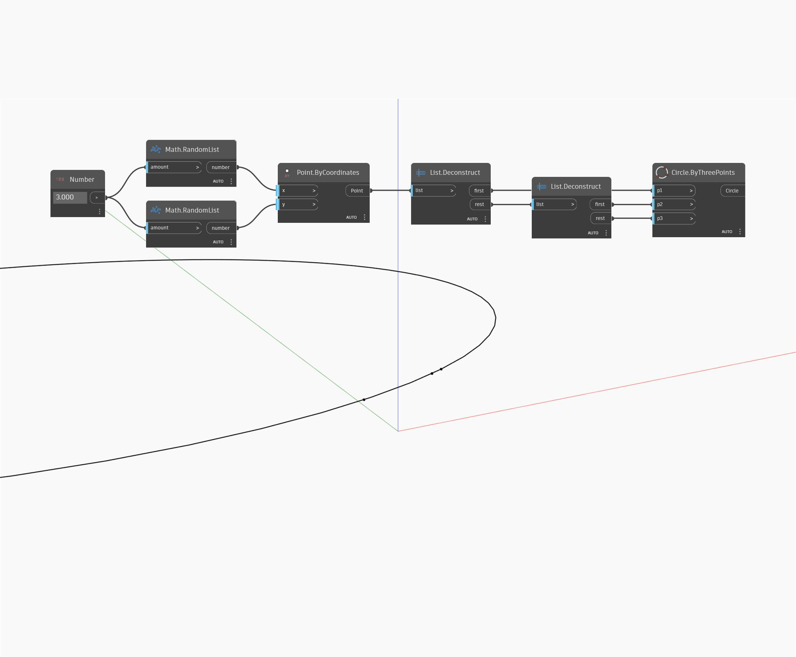

## In Depth
Plane by Three Points will create a plane that passes through the three input points. The points must not be co-linear. In the example below, we use three code blocks to define the three initial points, then use ByThreePoints to create a plane.
___
## Example File

