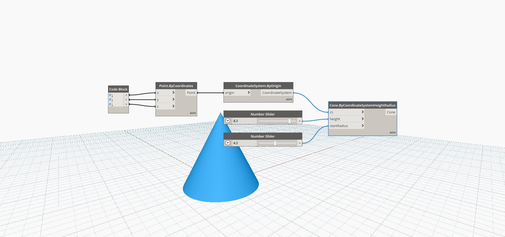

## In Depth
Cone ByCoordinateSystemHeightRadius creates a Cone geometry from a Radius, the Cone Origin, and a Height value. This example shows a dynamic Cone around the World Origin, constructed with two Number Sliders.
___
## Example File

