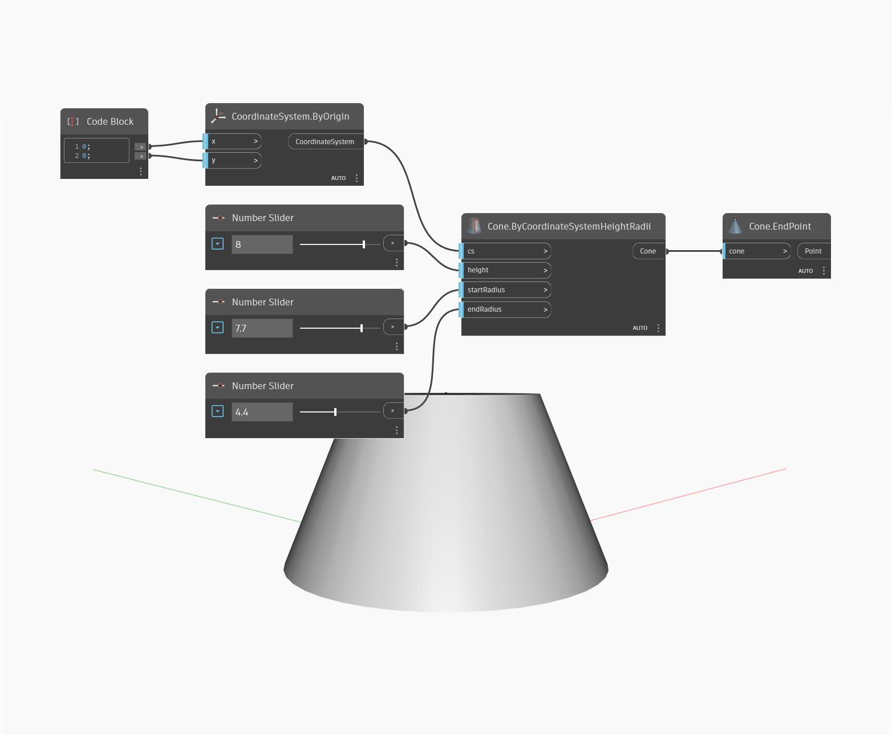

## In Depth
End Point will return the end point of an input curve. In the example below, we first create a Nurbs Curve using a ByControlPoints node, with a set of randomly generated points as the input. We can find the end point of this curve by using an EndPoint node.
___
## Example File

