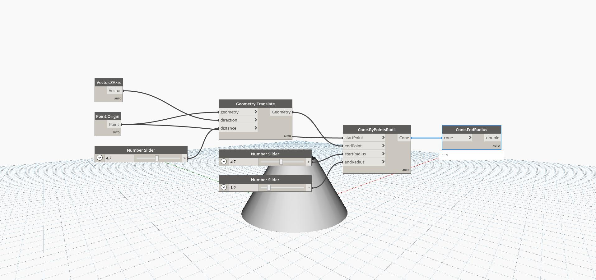

## In Depth
End Radius will find the radius of the top circle of a truncated cone. In the example below, we create a cone by specifying a start and end point, as well as a start and end radius. We can then extract the End Radius back from the cone.
___
## Example File

