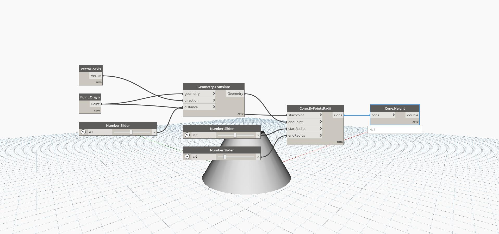

## In Depth
`Cone.Height` finds the height of a cone, which is equal to the distance between its start point and end point. 

In the example below, we create a cone by specifying a start and end point, as well as a start and end radius. We can then extract the height of the cone with `Cone.Height`.

___
## Example File

