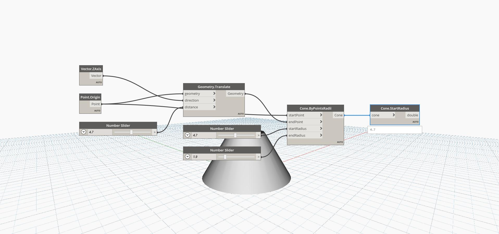

## In Depth
Start Radius will find the radius of the base circle of a cone. In the example below, we create a cone by specifying a start and end point, as well as a start and end radius. We can then extract the Start Radius back from the cone.
___
## Example File

