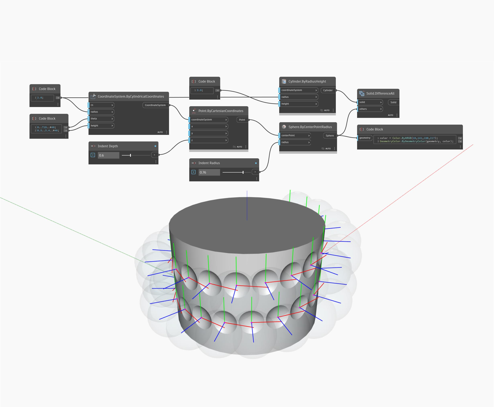

## In Depth
The Point By Cylindrical Coordinates node creates a point located within a cylindrical space. Here, we set the lacing to Cross-Reference and use a range of angles and elevations to generate a grid of points along a cylinder with a dynamic radius.
___
## Example File

