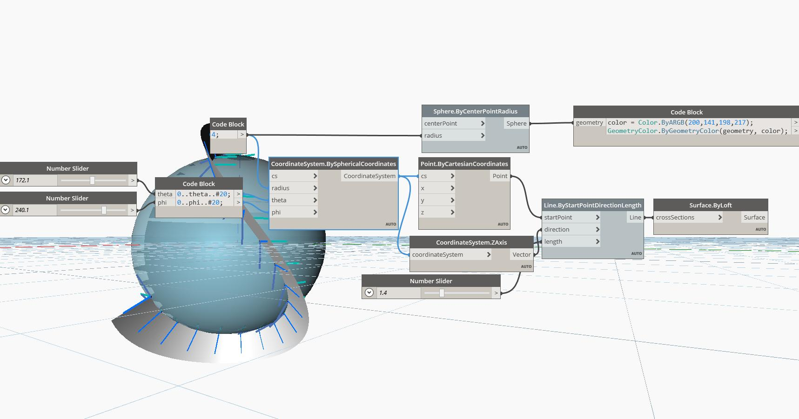

## In Depth
The Point By Spherical Coordinates node creates a point located within a spherical space. Here, we set the lacing to Cross-Reference and use a range of phi and theta angles to generate a grid of points along a cylinder with a dynamic radius. The location of the sphere is set to a Coordinate System with the origin (1, 5, 1).
___
## Example File

