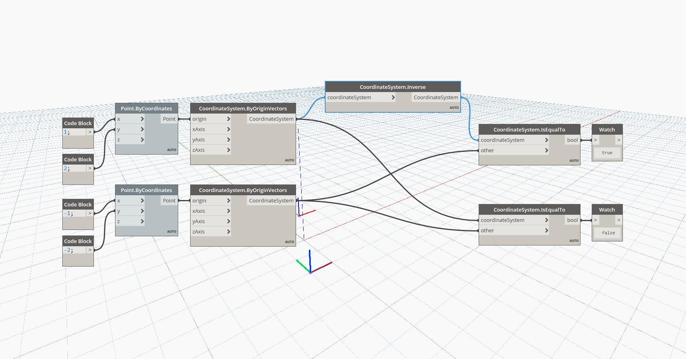

## In Depth
Inverse will return an inverted CoordinateSystem from the input. In the example below, a CoordinateSystem at (1,2,0) is inverted into a CoordinateSystem at (-1,-2,0). The geometry drawn on the CoordinateSystems will be opposite the WCS origin from each other.
___
## Example File

