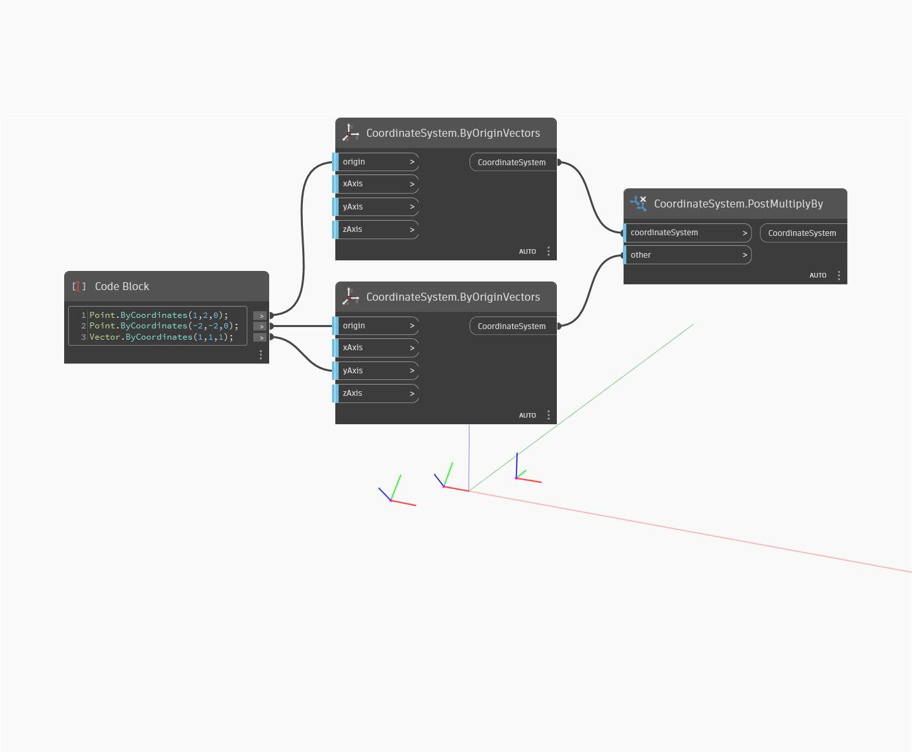

## In Depth
PostMultiplyBy will return a new CoordinateSystem from multiplying it by a CoordinateSystem and other (argument) CoordinateSystem. In the example below, a new CoordinateSystem is returned that is translated and rotated relative to the CS it was multiplied by and it's argument. Switching the coordinatesystem and other inputs will produce a different result as one is applied after the other.
___
## Example File

