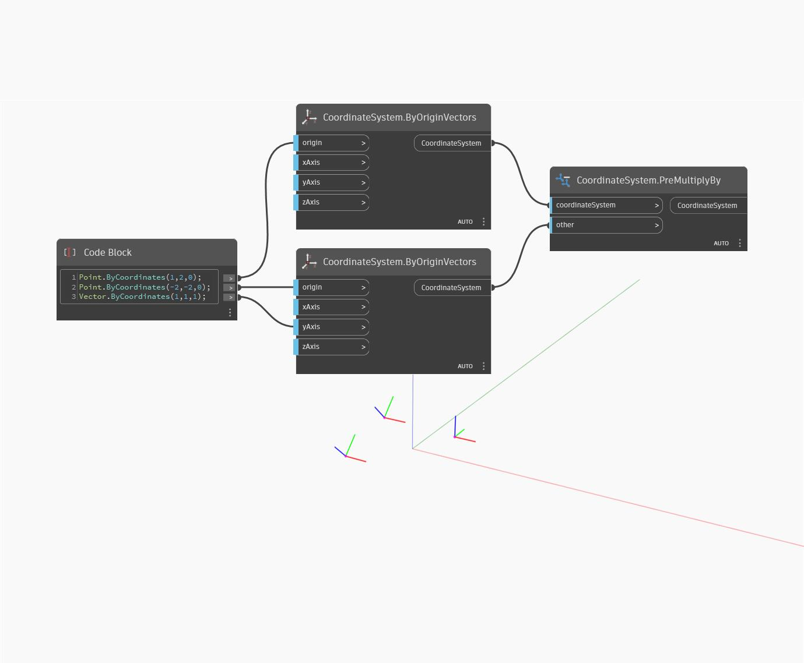

## In Depth
PreMultiplyBy will return a new CoordinateSystem from multiplying it by an other (argument) CoordinateSystem and a CoordinateSystem. In the example below, a new CoordinateSystem is returned that is translated and rotated relative to the CoordinateSystem it was multiplied by and it's argument. This node is similar to the PostMultiplyBy node with the only difference being that the other input is applied before the coordinatesystem input.
___
## Example File

