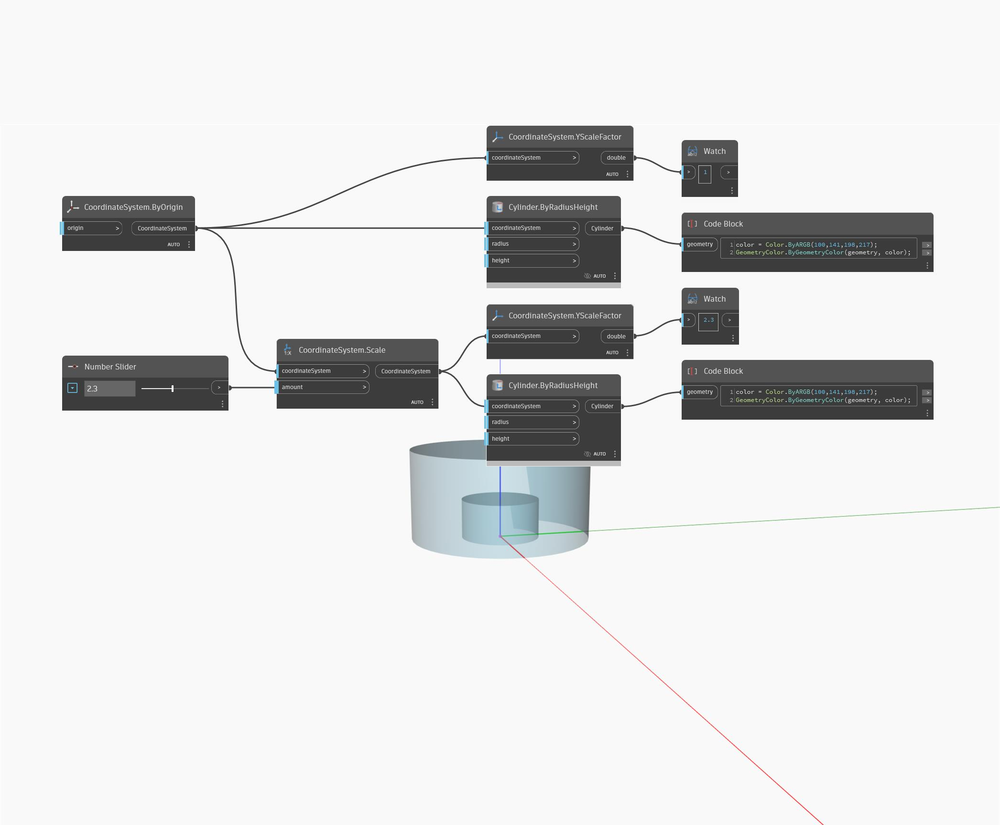

## In Depth
YScaleFactor will return a double representing the scale factor along the Y Axis. In the example below, a cylinder is scaled by 2.3, returning an Y scale factor of 2.3.
___
## Example File

