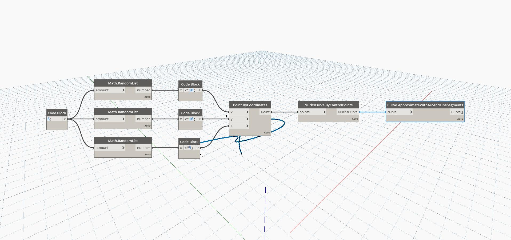

## In Depth
Approximate with Arc and Line Segments takes a curve as input, and returns a list of straight line and arc curves that approximate the original curve. In the example below, we first create a Nurbs Curve using a ByControlPoints node, with a set of randomly generated points as the input. This curve is then used as the input for an ApproximateWithArcAndLineSegments node.
___
## Example File

