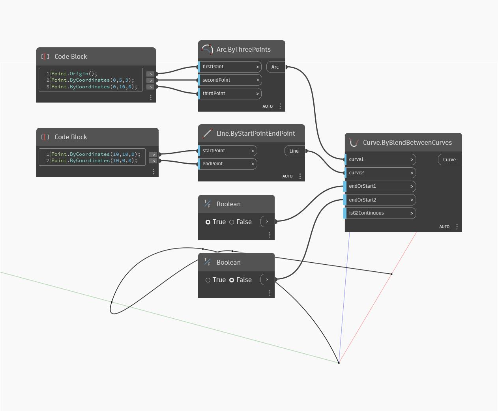

## In Depth
Curve by Blend Between Curves will create a new curve that connects two input curves. The two 'endOrStart' inputs determine whether to connect the end or start points of each curve. The created curve will match the curvature of the original curves at the connection points. In the example below, we start with one arc and one line. We blend between the start of the arch and the end of the line to connect the two curves. Two boolean toggle nodes let us control which ends of the two curves to blend between.
___
## Example File

