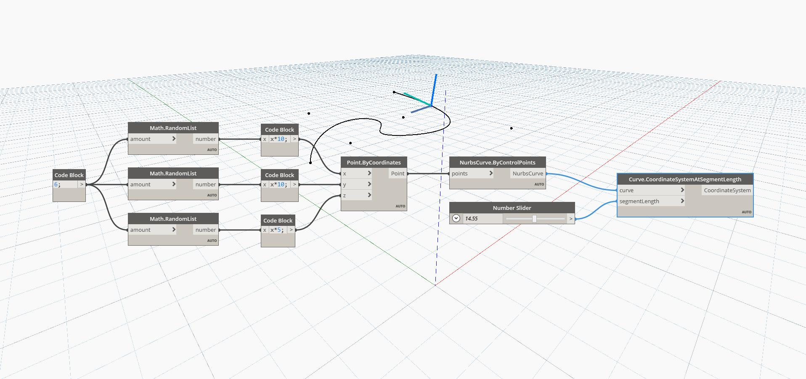

## In Depth
Coordinate System At Segment Length will return a coordinate system aligned with the input curve at the specified curve length, measured from the start point of the curve. The resulting coordinate system will have its x-axis in the direction of the normal of the curve and the y-axis in the direction of the tangent of the curve at the specified length. In the example below, we first create a Nurbs Curve using a ByControlPoints node, with a set of randomly generated points as the input. A number slider is used to control the segment length input for a CoordinateSystemAtParameter node. If the specified length is longer than the length of the curve, this node will return a Coordinate System at the end point of the curve.
___
## Example File

