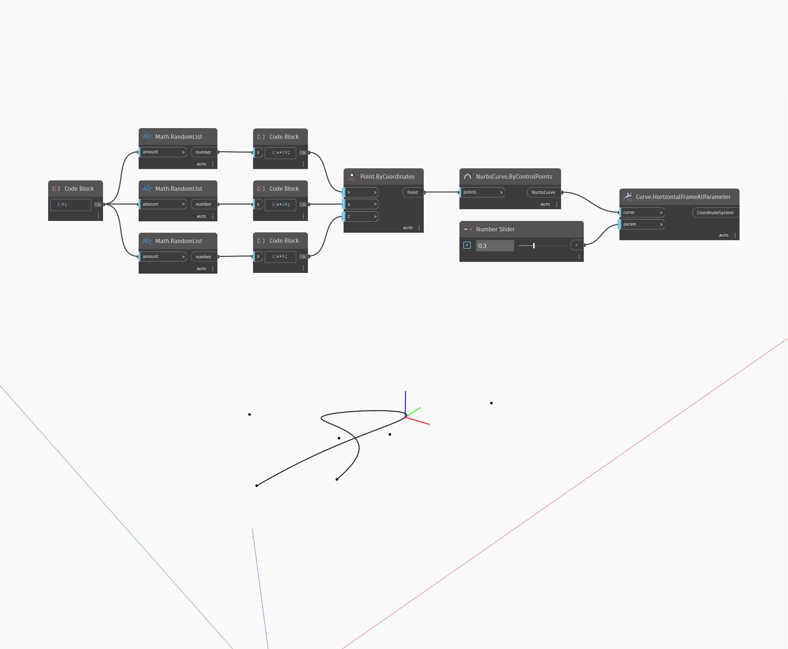

## In Depth
Horizontal Frame At Parameter will return a coordinate system aligned with the input curve at the specified parameter. The parameterization of a curve is measured in the range from zero to one, with zero representing the start of the curve and one representing the end of the curve. The resulting coordinate system will have its z-axis in the world Z direction, and the y-axis in the direction of the tangent of the curve at the specified parameter. In the example below, we first create a Nurbs Curve using a ByControlPoints node, with a set of randomly generated points as the input. A number slider set to the range 0 to 1 is used to control the parameter input for a HorizontalFrameAtParameter node.
___
## Example File

