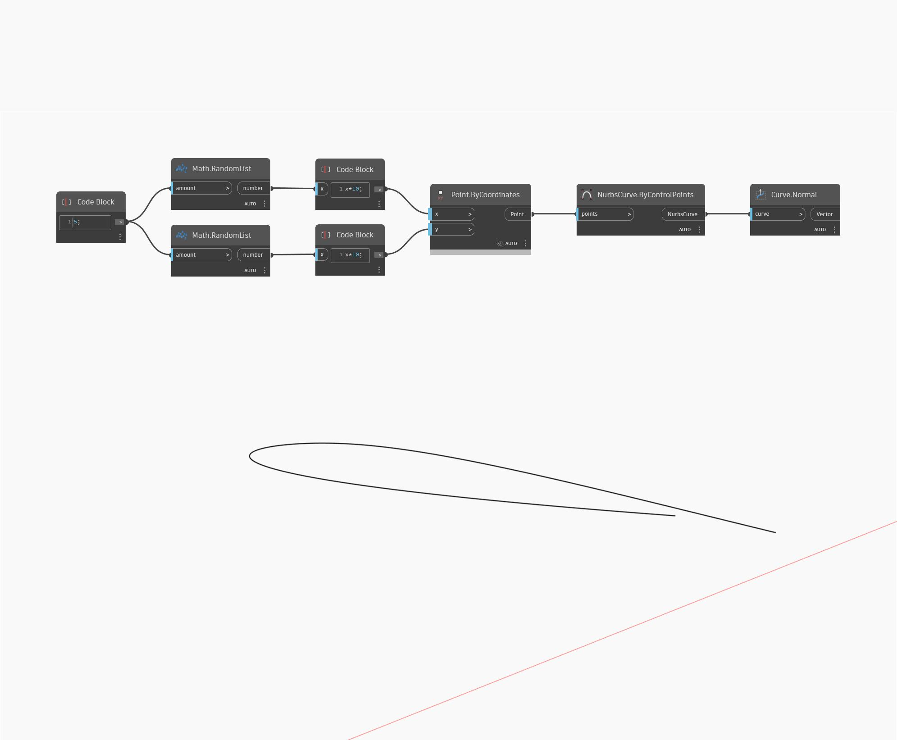

## In Depth
Plane Normal will find the normal vector of an input plane. This is also equal to taking the cross product of the plane XAxis and YAxis. In the example below we first use a set of random points to create a Plane by Best Fit Through Points. We can then find the normal vector of this plane.
___
## Example File

