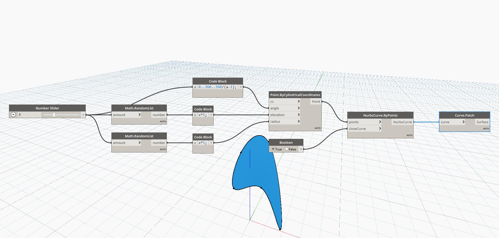

## In Depth
Patch will attempt to create a surface using an input curve as the boundary. The input curve must be closed. In the example below, we first use a Point.ByCylindricalCoordinates node to create a set of points at set intervals in a circle, but with random elevations and radii. We then use a NurbsCurve.ByPoints node to create a closed curve based on these points. A Patch node is cused to create a surface from the boundary closed curve. Note that because the points were created with random radii and elevations, not all arrangements result in a curve that is able to be patched.
___
## Example File

