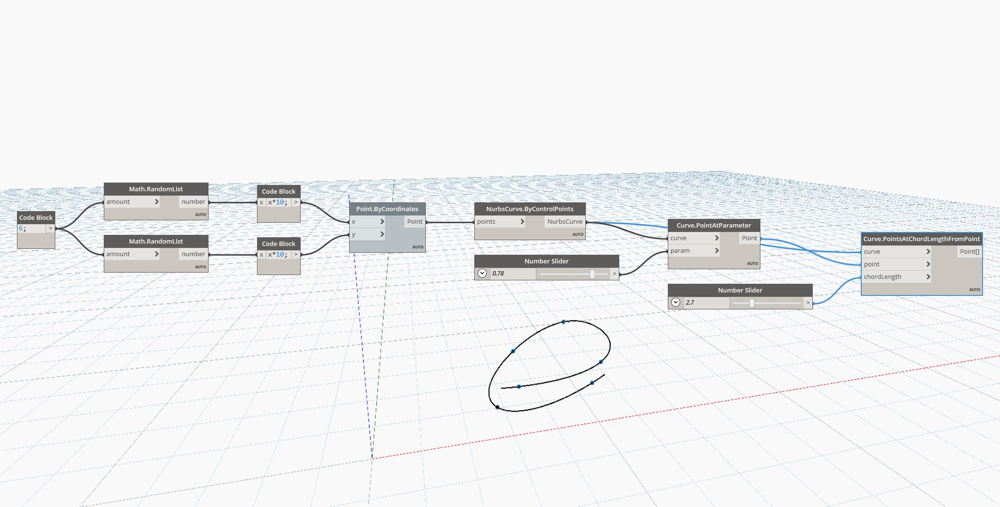

## In Depth
Points At Chord Length From Point will return a list of points along a curve, measured sequentially according to an input chord length starting from a specified point along the curve. In the example below, we first create a Nurbs Curve using a ByControlPoints node, with a set of randomly generated points as the input. A PointAtParameter node is used with a number slider set to the range 0 to 1 to determine the initial point along the curve for a PointsAtChordLengthFromPoint node. Finally, a second number slider is used to adjust the straight-line chord length to use.
___
## Example File

