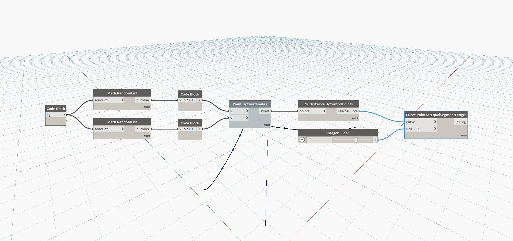

## In Depth
Points At Equal Segment Length will return a list of points along an input curve by dividing the curve into equal length segments. The number of divisions to use is input as an integer, and will result in that number of points divided equally in the interior of the curve. This node will not include the end points of the curve. In the example below, we use two sets of random numbers to generate a list of points. These points are used to create a Nurbs Curve by Control Points. An integer slider is used for the divisions input in a PointsAtEqualSegmentLength node.
___
## Example File

