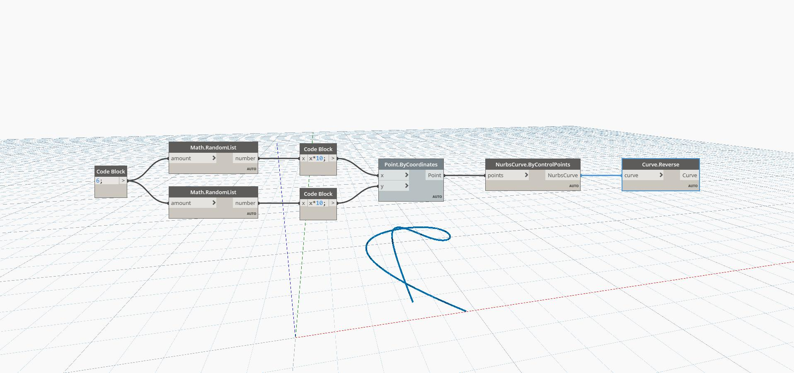

## In Depth
Reverse will return a new Vector pointing in the opposite direction from its input. In the example below, a Vector of (1,0,1) will return a Vector of (-1,0,-1). Adjusting the Vector Direction slider will change the vector's coordinate values and return a different reversed vector. The Vectors are represented as Lines.
___
## Example File

