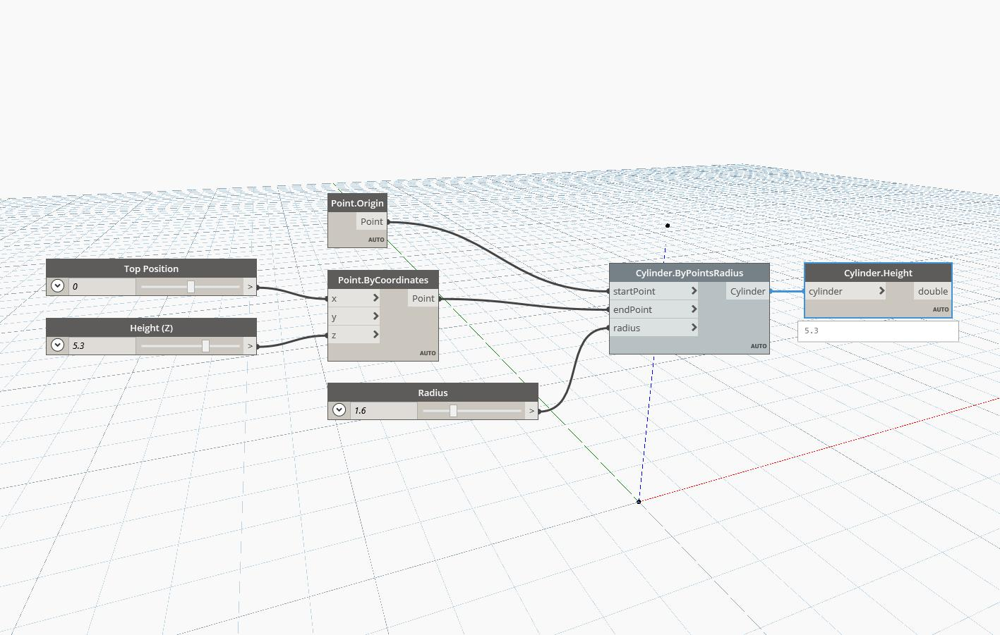

## In Depth
`Cylinder.Height` returns the height of the input cylinder. The height value is relative to the view scale.

In the example below, we generate a cylinder by start point, end point, and radius, and then use a `Cylinder.Height` node to find the height.

___
## Example File

