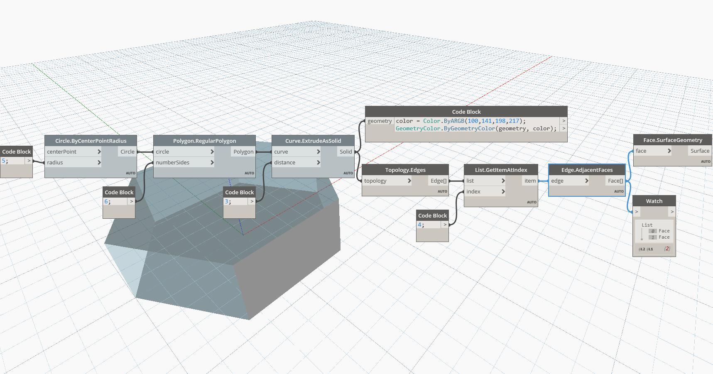

## In Depth
AdjacentFaces will return the Faces adjacent to an input Vertex. In the example below, a Vertex on a Cuboid will return a List of three Faces. Adjusting the Index Selector slider will change the input Vertex and return different sets of adjacent Faces. The Faces are represented as Surfaces.
___
## Example File

