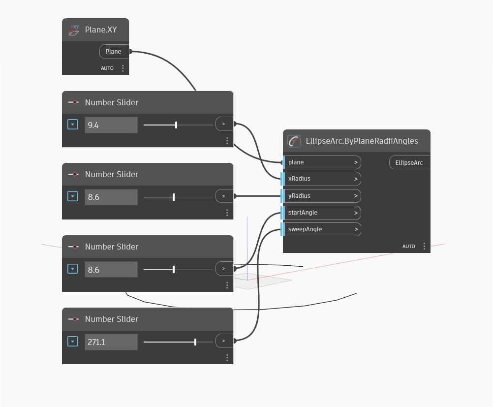

## In Depth
Ellipse Arc by Plane Radii Angles creates a portion of an ellipse. The input xRadius and yRadius give the radii of the ellipse along the X and Y directions of the input plane (which may be different than world X and Y). The startAngle input defines the beginning point of the arc along the ellipse in degrees, starting counter-clockwise from the plane X-axis, and continuing for a total arc length of the sweepAngle input. In the example below, we use the XY plane, and a series of number sliders to control the other input parameters.
___
## Example File

