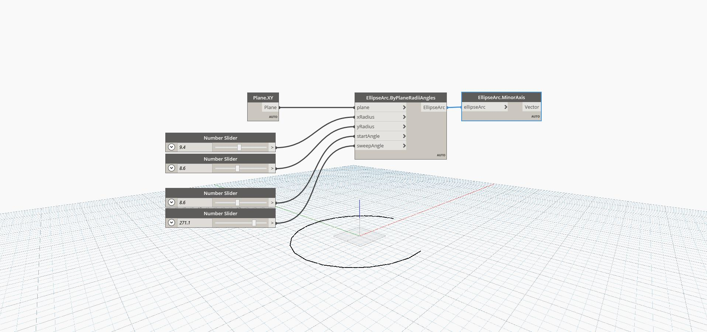

## In Depth
Minor Axis will return the shorter of the two axes of the ellipse. The axis is output as a vector, which has a magnitude equal to the shorter of the two radii. Note that Major and Minor axes are determined by length, not by direction. That is, the minor axis might correspond to the xAxisRadius of one ellipse, but the yAxisRadius of a different ellipse.  In the example, we first create an Ellipse Arc by using the XY plane and a series of number sliders. We then use Minor Axis to extract the minor axis of the ellipse.
___
## Example File

