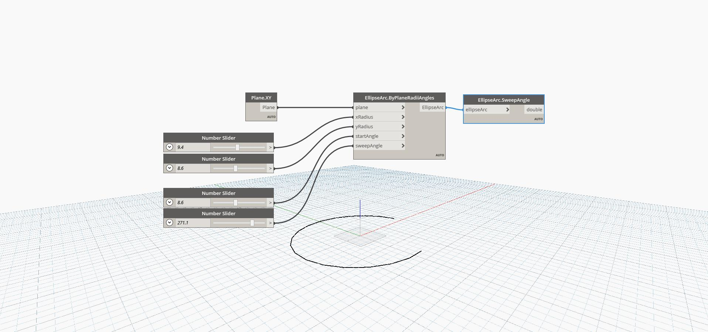

## In Depth
Sweep Angle finds the starting angle of the ellipse arc. This is measured in degrees counter-clockwise on the ellipse plane, starting from the start angle. The end angle of the ellipse would be equal to the start angle plus the sweep angle. In the example, we first create an Ellipse Arc by using the XY plane and a series of number sliders. We then use Sweep Angle to extract arc length of the ellipse arc.
___
## Example File

