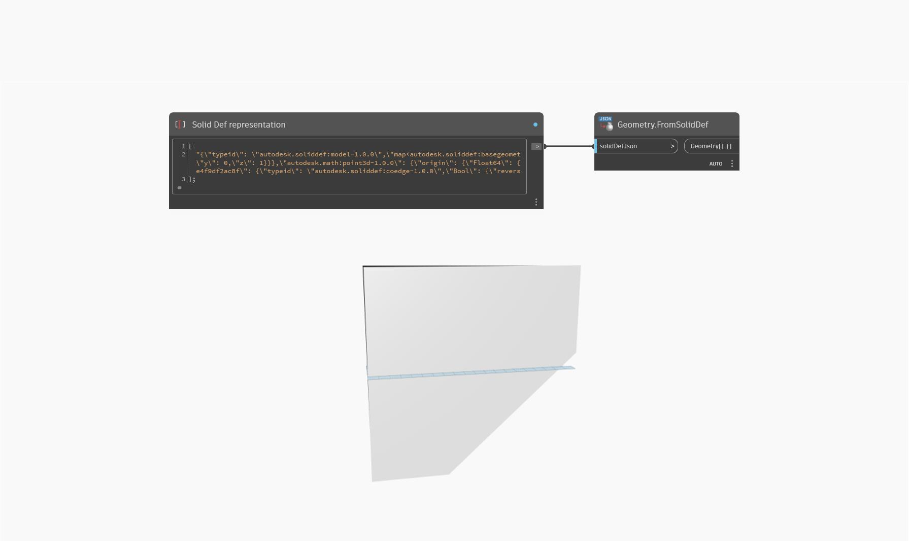

## In Depth
`Geometry.FromSolidDef` imports a Solid Def JSON string and returns an array of imported geometries. It converts the JSON formatted representation back into geometry format. Use `Geometry.ToSolidDef` to convert geometries into a JSON string format.

In the example below, a Solid Def representation is converted into geometry.
___
## Example File

