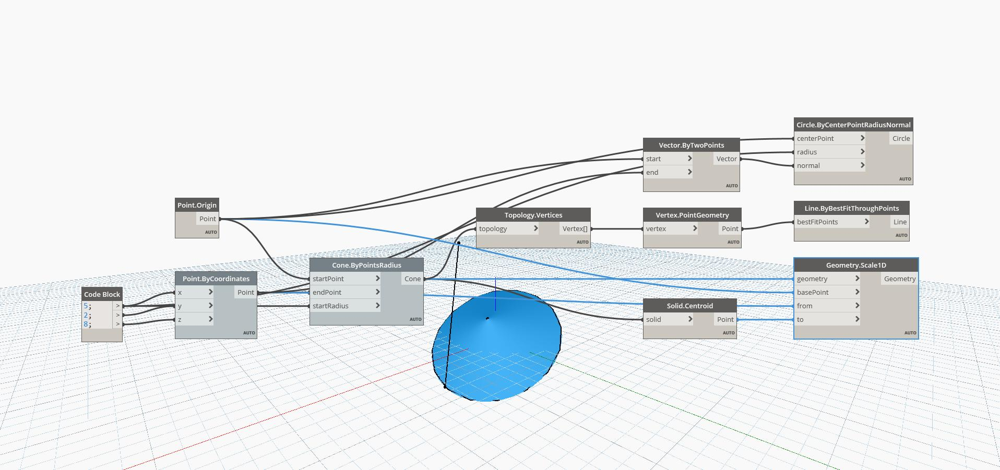

## In Depth
Geometry Scale1D Scales a Geometry in one direction from a Base Point and two reference Points. In the example file, a Cone is scaled from its End Point to its Centroid in relation to the Cone Start Point. The original Cone Edges are drawn as a visual reference.
___
## Example File

