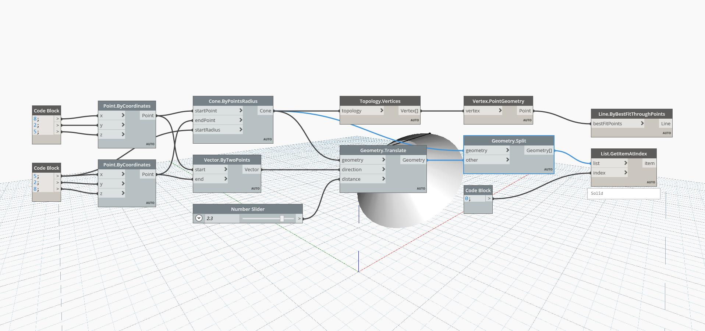

## In Depth
The Geometry Split Node functions similarly to the Geometry Trim Node. It inputs a Tool – any type of Geometry that you will be trimming another Geometry with – and a Geometry, and returns all of the fragments of Geometry. In this example, a Cone is Split with a similar Cone. Although all fragments are returned by the Geometry Split Node, one is previewed in the example file.
___
## Example File

