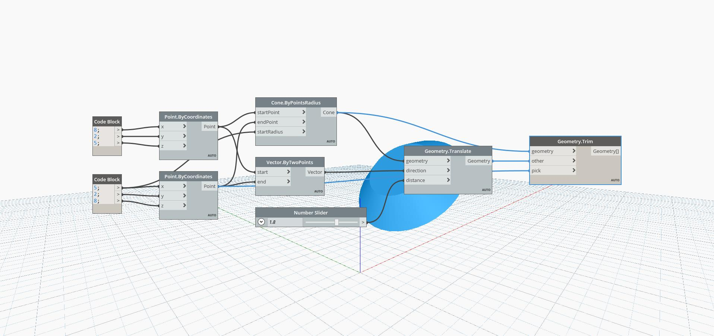

## In Depth
Geometry Trim functions similarly to the Geometry Split Node in that it inputs a Tool – any type of Geometry that you will be trimming another Geometry with – and a Geometry, but returns only a single fragment of the Geometry. The Geometry that is Picked is selected by a reference Point closest to the fragment. In this example, one Cone is Trimmed by another, with its lower portion Picked.
___
## Example File

