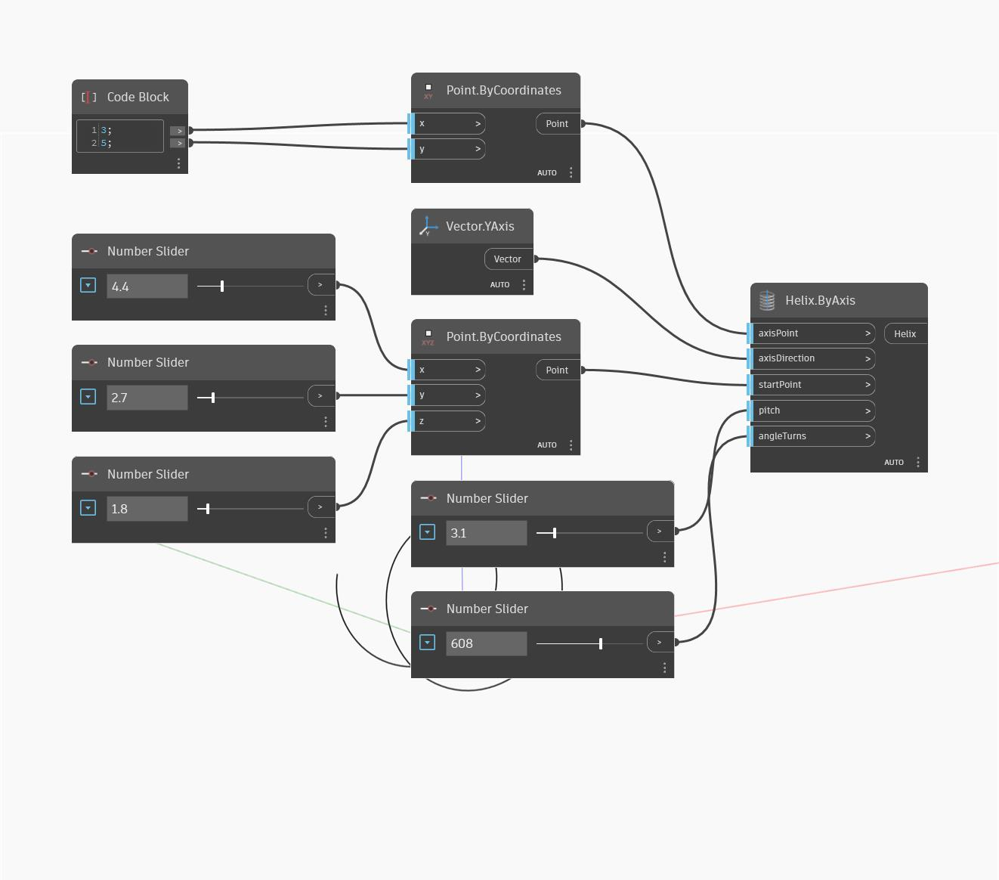

## In Depth
Helix By Axis creates a helix. The axis of the helix is defined by the input axis point and the axis direction. The helix will be created counter-clockwise around the axis, starting from the start point and continuing for an angular length of the Angle Turns input, in degrees. The Pitch input determines the distance of the helix per each 360 degrees in the direction of the axis. In the example below, we start the helix at the point (3,5) and use the Y-axis to define the helix axis. The start point of the helix is controlled by three number sliders. The pitch and angleTurns use two more number sliders. Note that the angleTurns is in degrees.
___
## Example File

