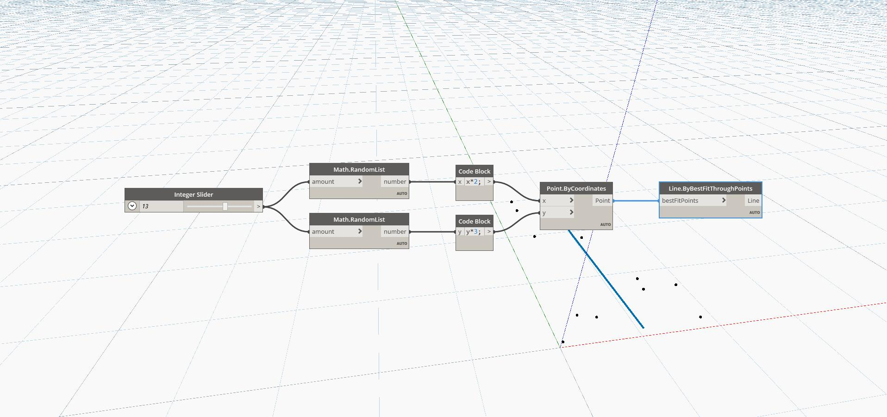

## In Depth
`Line.BestFitThroughPoints` creates a line by approximating a scatter plot of points. The input is a list of points. 

In the example below, we use a number slider to control the number of random points generated and then find the best fit line through the set of points.

___
## Example File

