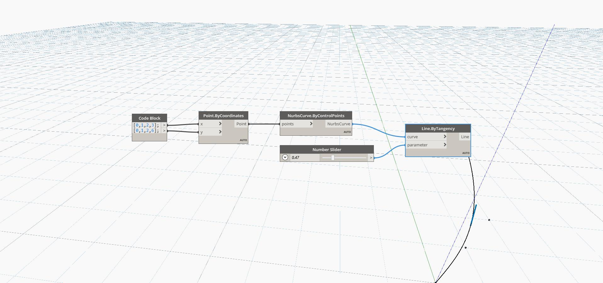

## In Depth
Line By Tangency creates a line tangent to an input curve, and with a length of 1 unit. The parameter input specifies the position along the curve to evaluate, with a parameter of zero being the beginning of the curve, and a value of 1 being the end of the curve. In the example, we use a Code Block to generate two lists corresponding to X and Y locations of a series of points. The points are used to draw a Nurbs Curve. We then use a number slider between 0 and 1 as an input parameter to create a line tangent to the curve.
___
## Example File

