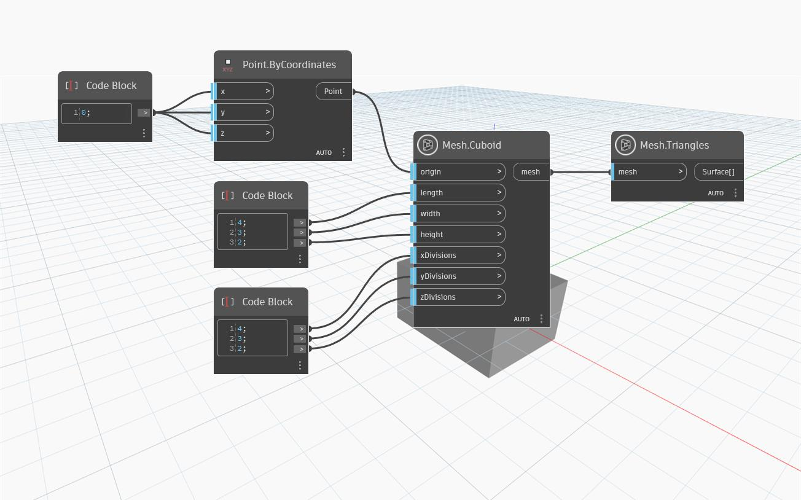

## In-Depth
`Mesh.Cuboid` creates a mesh cuboid centered at the input point, with a given `width`, `length` and  `height` and a given number of divisions along X, Y, Z directions. If the number of divisions is not explicitly specified or any of the inputs `xDivisions`, `yDivisions` or `zDivisions` is equal to zero, the default value of 5 divisions is used along all directions.
In the example below, `Mesh.Cuboid` node is used to create a cuboid mesh and the `Mesh.Triangles` node is used to visualize the distribution of mesh triangles.

## Example File

