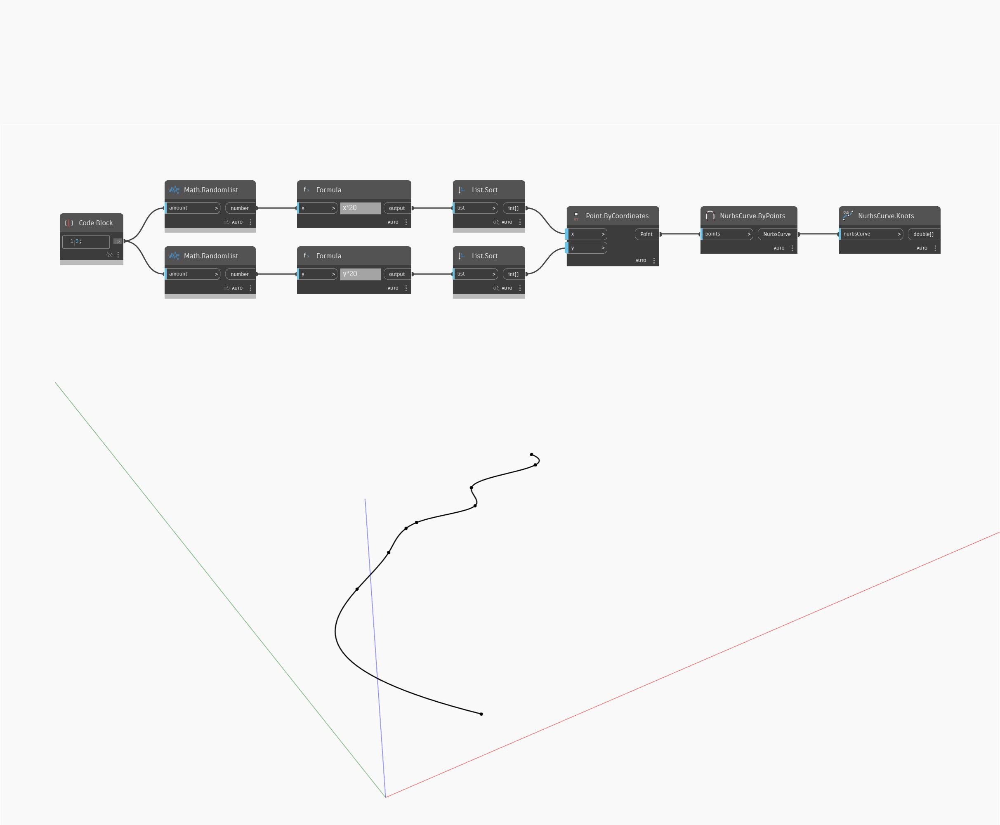

## In Depth
Knots will return the knots of a NURBS curve as a list of numbers. In the example, we first generate a number of random points, and then use NurbsCurve ByPoints to create a curve interpolated through the points. We can use Knots to then get a list of the knots for this curve.
___
## Example File

