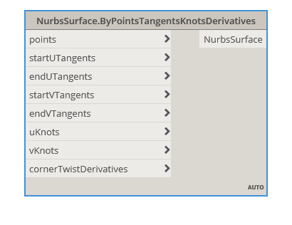

## In Depth
Creates a NurbsSurface satisfying a collection of different surface characteristics. This is the most advanced surface fitting method. The resultant surface will pass through all of the points. The number of tangents must match the number of points in the corresponding direction. The resultant surface will be degree 3 in both the U and V direction. The corner derivatives should be second order (dP/dUdV) and should be supplied in this order [ lowU, lowV ], [ highU, lowV ], [ lowU, highV ], [ highU, highV ].
___
## Example File

