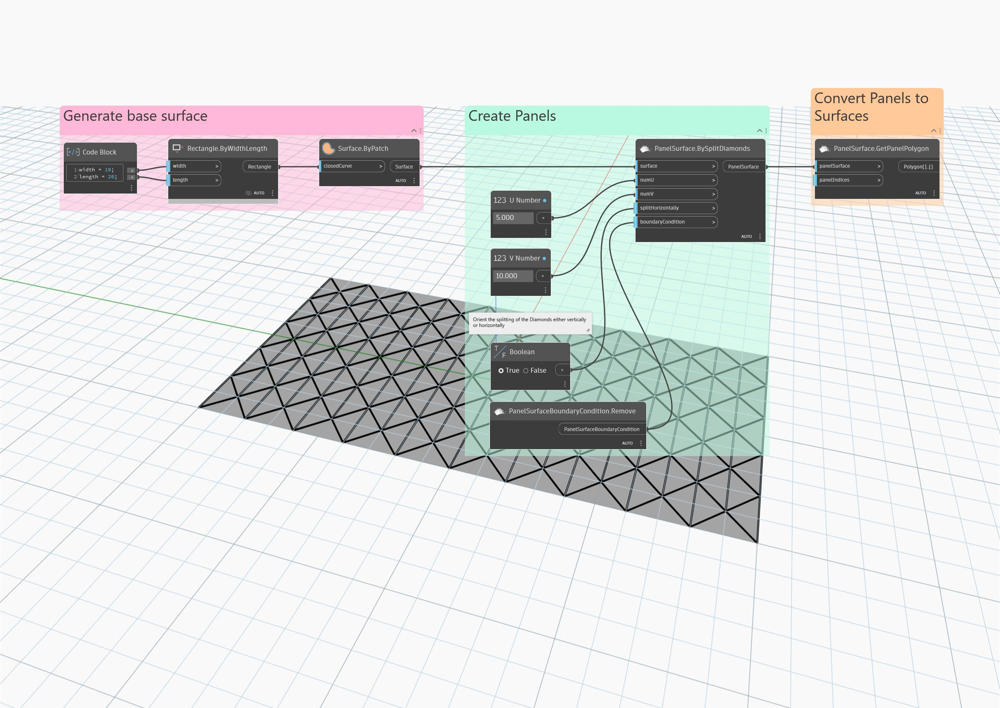

## In Depth
Panels the input surface in a diamond-shaped pattern, with each diamond split vertically or horizontally into two triangles. By default, each diamond is split vertically.
___
## Example File

