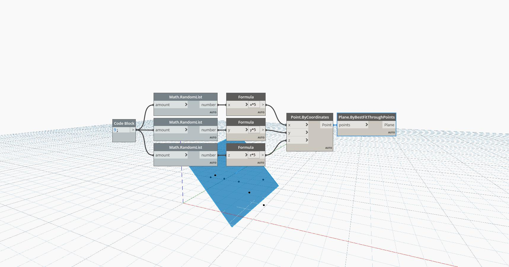

## In Depth
Plane By Best Fit Through Points uses a set of points and finds the plane that best approximates the set. In the example, we use a series of RandomList components to generate random x,y and z coordinates. The points are created By Coordinates, and the list of points is then used as an input for ByBestFitThroughPoints.
___
## Example File

