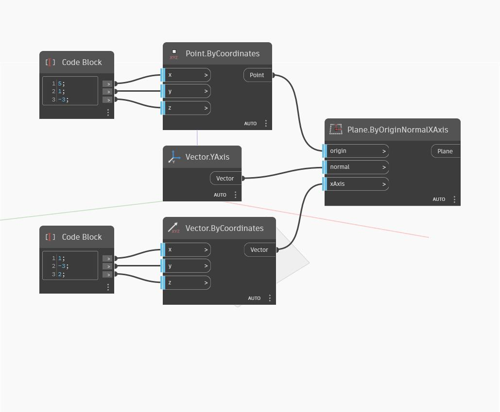

## In Depth
Plane by Origin Normal XAxis is similar to Plane By Origin Normal, but this allows us to also input a direction for the XAxis to control the orientation of the plane. If the input xAxis vector is not in the plane defined by the origin and normal inputs, it is first projected onto the plane to determine the Plane XAxis. In the example below, we use world YAxis as the normal vector, and use two code blocks to define the origin point and input xAxis.
___
## Example File

